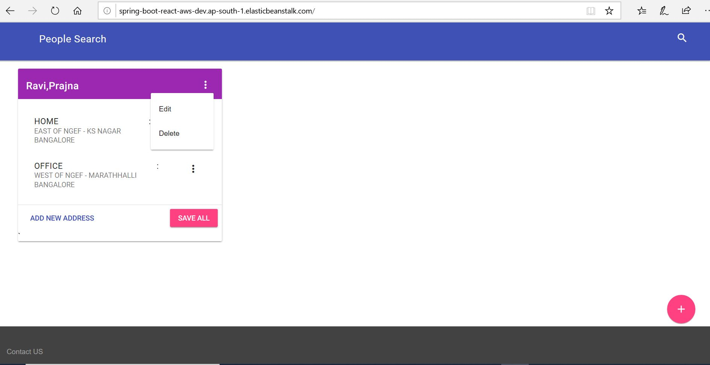

# spring-boot-react-aws
spring-boot-react-aws is springboot application with think client built with react and material design hosted on AWS EB

# DEMO
Click on image

# Pre-req / Running app
1. Install lombok plugin to your ide
2. Java8, maven required
3. mvn clean install 
4. java -jar target/spring-boot-react-aws-0.0.1-SNAPSHOT.jar

# Open items
1. Integrating ADD/Update API with UI ( API can be used via swagger)
2. Writing search API

# All API are exposed via swagger 
http://spring-boot-react-aws-dev.ap-south-1.elasticbeanstalk.com/swagger-ui.html#/people-controller

# Sample JSON
Available under   resorce/json folder

#deploy on AWS EB
1. mvn clean install
2. eb use spring-boot-react-aws-dev
3. eb deploy
4. eb open
